# Membuat Database
1. Membuat database pada cmd
	code 
 ```sql
 CREATE DATABASE company_herani;
 ```

   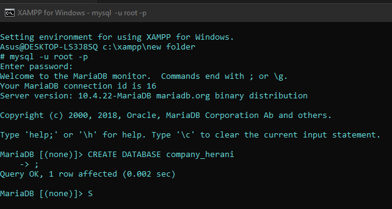 
  analisis 
  - ``create database`` : digunakan untuk membuat database pada mysql yang dapat menempung data.
  -  ``company_herani`` : adalah nama database yang digunakan pada mysql.
2. Menggunakan database
	code 
  ```sql
  USE company_herani;
  ```
  
  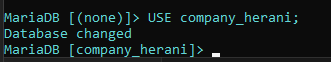  
  analisis
  - ``USE ``: digunakan ketika ingin menggunakan database.
  - ``[company_herani]`` adalah alamat database yang ingin digunakan 
  
# Membuat table 
code:
```sql
CREATE TABLE pegawai (
NIP int(3) AUTO_INCREMENT PRIMARY KEY NOT NULL,
NDep varchar(50) NOT NULL,
NBlk varchar(50),
jenis_kelamin enum('Laki-laki','Perempuan') NOT NULL,
alamat text(50) NOT NULL,
Telp varchar(20) NOT NULL,
jabatan enum('Manajer','Staf','Sales'),
Gaji BIGINT NOT NULL,
NoCab varchar(50) NOT NULL
);
```

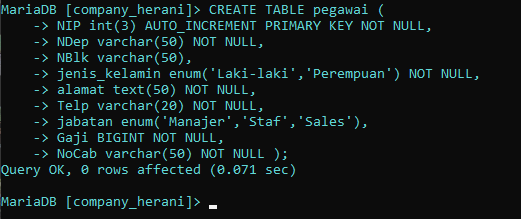

analisis 
-  `create table` :  digunakan untuk membuat table pada database yang telah dibuat.
- Kolom `NIP` : kolom yang merupakan primary key yang akan diisi dan tidak boleh ada data yang sama, dengan tipe data `int(3)` dengan maksimal data 3 digit dan menggunakan fitur AUTO_INCREMENT.
- Kolom `NDep` : menyimpan data nama depan dengan tipe data `varchar(50)` dengan panjang data 50 karakter dan `NOT NULL ` yang bersifat wajib diisi.
-  Kolom `NBlk` : menyimpan data nama belakang dengan tipe data `varchar(50)` dengan panjang data 50 karakter dan  bersifat opsional / bisa tidak diisi.
- Kolom `jenis_kelamin` : menyimpan data jenis kelamin dengan tipe data `enum` digunakan untuk mendefinisikan sekumpulan nilai yang mewakili status atau kondisi tertentu dan bersifat `NOT NULL` yang bersifat wajib diisi.
- Kolom `alamat` : menyimpan data alamat dengan tipe data `text` 

# Menampilkan table 
code 
```sql
DESC pegawai;
```

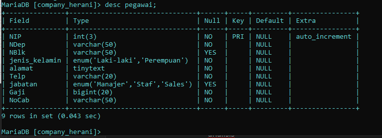
analisis 
- ``desc ``: di gunakan untuk menampilkan tabel yang telah dibuat.
- ``pegawai ``: adalah nama tabel yang ingin di tampilkan.
# Memasukkan data 
 code 
 ```sql
 INSERT INTO pegawai value
 (data yang ingin di masukkan);
```

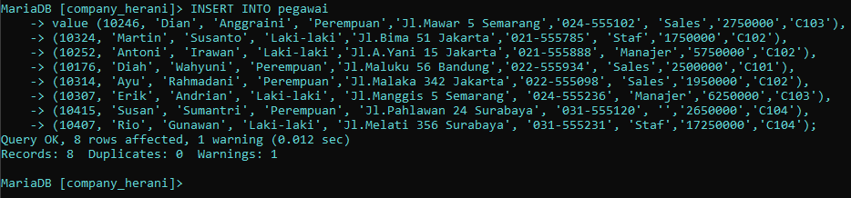

analisis 
- `INSERT INTO` :  di gunakan untuk memasukkan data pada tabel.
- `pegawai` : adalah nama tabel yang ingin di masukkan datanya.
-  `VALUE`:  di gunakan untuk data yang di masukkan. 

# Menampilkan data 
1. Menampilkan seluruh data pada table 
	code
	```sql
	SELECT * FROM pegawai;
	```

   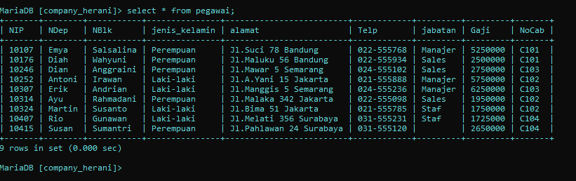
   
   analisis 
  - `SELECT` : di gunakan untuk menampilkan data yang sudah di masukkan.
   - ``* ``:  di gunakan untuk memilih semua kolom yang ada dalam tabel tertentu.
   - `FROM`:  adalah alamat tabel yang ingin di tampilkan.
   - `pegawai`:  adalah nama tabel yang ingin di tampilkan.
2. Menampilkan jumlah pegawai dan jabatan
   code
   ```sql
   SELECT COUNT(NIP) AS jumlahpegawai, COUNT(jabatan) AS jumlahjabatan FROM pegawai;
   ```

   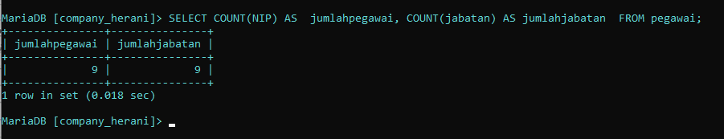
   
   ANALISIS :
   - `SELECT ` : digunakan untuk menentukan kolom apa yang ingin tampilkan dalam hasil query.
   - `COUNT(NIP)` : digunakanuntuk menghitung jumlah baris dalam tabel `pegawai` yang di mana `(NIP)` berfungsi menghitung  jumlah baris yang ada di dalamnya. 
   - `AS jumlahpegawai` : Hasil perhitungan diberi nama `jumlahpegawai`, yang menjelaskan bahwa ini adalah jumlah total pegawai.
   - `COUNT(jabatan)` : digunakan untuk menghitung jumlah baris dalam tabel `pegawai` yang dimana `(jabatan)` berfungsi untuk menghitung jumlah baris yang ada didalamnya. 
   - `AS jumlahjabatan` :   digunakan untuk menghitung jumlah baris dalam tabel `pegawai`.
   - `FROM pegawai` : digunakan untuk menentukan tabel yang akan diambil, data diambil dari tabel `pegawai`.
3. Menghitung jumlah baris data pada table NoCab 'C102'
   code 
   ```sql
   SELECT COUNT(NIP) AS jumlahpegawai
   FROM pegawai WHERE NoCab = 'C102';
   ```

   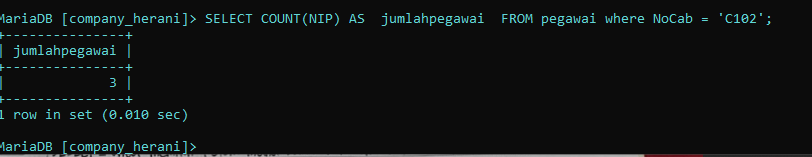

   Analisis : 
  - `SELECT` : digunakan untuk menentukan kolom apa yang ingin tampilkan dalam hasil query. 
  - `COUNT(NIP)` :  digunakan untuk menghitung jumlah kolom pada tabel `pegawai`  yang di mana `(NIP)` berfungsi menghitung  jumlah baris yang ada di dalamnya. 
  - `AS jumlahpegawai` : Hasil perhitungan diberi nama `jumlahpegawai`, yang menjelaskan bahwa ini adalah jumlah total pegawai.
  - `FROM pegawai` : digunakan untuk menunjukkan dari tabel mana data tersebut diambil, data diambil dari tabel `pegawai`.
  - `WHERE NoCab = 'C102'` :  digunakan untuk menyeleksi data pada baris dalam tabel `pegawai` yang memilki data `NoCab` sama dengan `C102` yang akan dihitung. 
4. Mengelompokkan data 
   code
   ```sql
   SELECT NoCab, COUNT(NIP) AS jumlah_pegawai
   FROM pegawai GROUP BY NoCab;
   ```
   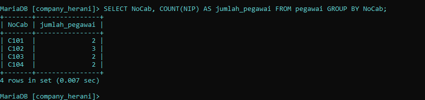

   Analisis:
   - `SELECT NoCab`  : digunakan untuk menentukan kolom `NoCab`  yang ingin  tampilkan dalam hasil query.
   - ` COUNT(NIP)` : digunakan untuk menghitung jumlah kolom pada tabel `pegawai`  yang di mana `(NIP)` berfungsi menghitung  jumlah baris yang ada di dalamnya. 
   -  `AS jumlah_pegawai` : Hasil perhitungan diberi nama `jumlah_pegawai`, yang menjelaskan bahwa ini adalah jumlah total pegawai.
   - `FROM pegawai` : digunakana untuk menunjukkan dari tabel mana data tersebut diambil, data diambil dari tabel `pegawai`. 
   - `GROUP BY NoCab` : digunakan untuk mengelompokkan hasil berdasarkan kolom `NoCab`. yang dimana akan dihitung jumlah pegawai (`jumlah_pegawai`) untuk setiap cabang.

5. Menampilkan suatu kelompok data dengan menentukan kondisi yang dipenuhi
   code 
   ```sql
   SELECT NoCab, COUNT(NIP) AS jumlah_pegawai 
   FROM pegawai GROUP BY NoCab HAVING COUNT(NIP) >= 3;
   ```

   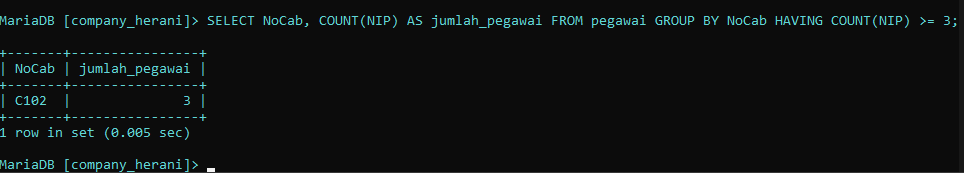

   Analisis : 
   - `SELECT NoCab` : digunakan untuk menentukan kolom `NoCab`  yang ingin tampilkan dalam hasil query.
   - `COUNT(NIP)` :  digunakan untuk menghitung jumlah kolom pada tabel `pegawai`  yang di mana `(NIP)` berfungsi menghitung  jumlah baris yang ada di dalamnya. 
   - `AS jumlah_pegawai` : Hasil perhitungan diberi nama `jumlah_pegawai`, yang menjelaskan bahwa ini adalah jumlah total pegawai.
   - `FROM pegawai ` : digunakana untuk menunjukkan dari tabel mana data tersebut diambil, data diambil dari tabel `pegawai`.
   - `GROUP BY NoCab` : digunakan untuk mengelompokkan hasil berdasarkan kolom `NoCab`. yang dimana akan dihitung jumlah pegawai (`jumlah_pegawai`) untuk setiap cabang.
   - `HAVING COUNT(NIP) >= 3` :  digunakan untuk memfilter hasil dari grup yang sudah dibentuk oleh `GROUP BY`. Dalam hal ini  grup-grup tersebut akan disaring dan hanya menampilkan cabang-cabang di mana jumlah pegawai (`jumlah_pegawai`) sama dengan atau lebih dari 3. 
6. Menampilkan suatu data yang telah di jumlahkan 
   code 
  ```sql
  SELECT SUM(Gaji) AS total_gaji
  FROM pegawai;
  ```

   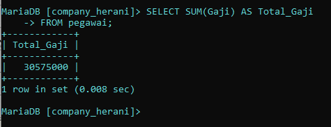 

   Analisis : 
   - `SELECT` : digunakan untuk menentukan kolom apa  yang ingin  tampilkan dalam hasil query.
   - `SUM(Gaji) ` :  digunakan untuk menghitung jumlah total dari nilai-nilai yang ada dalam kolom `Gaji`.
   - `AS total_gaji` : Hasil perhitungan diberi nama `total_gaji`, yang menjelaskan bahwa ini adalah jumlah total  gaji pegawai.
   - `FROM pegawai` : digunakana untuk menunjukkan dari tabel mana data tersebut diambil, data diambil dari tabel `pegawai`.
7. Menampilkan data gaji yang telah di jumlahkan pada jabatan 'Manajer' 
   code 
  ```sql
  SELECT SUM(Gaji) AS gaji_manajer
  FROM pegawai WHERE jabatan = 'Manajer' ; 
  ```

  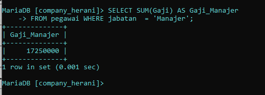

  Analisis : 
 - `SELECT` : digunakan untuk menentukan kolom apa  yang ingin  tampilkan dalam hasil query.
 - `SUM(Gaji) ` :  digunakan untuk menghitung jumlah total dari nilai-nilai yang ada dalam kolom `Gaji`.
 - `AS total_gaji` : Hasil perhitungan diberi nama `total_gaji`, yang menjelaskan bahwa ini adalah jumlah total  gaji pegawai.
 - `FROM pegawai` : digunakana untuk menunjukkan dari tabel mana data tersebut diambil, data diambil dari tabel `pegawai`.
 - `WHERE ` : digunakan untuk memfilter data sehingga hanya baris-baris yang memenuhi kondisi tertentu yang akan dihitung.
  - `jabatan = 'Manajer'` : hanya baris yang memiliki nilai `jabatan` sama dengan `'Manajer'` yang akan disertakan dalam perhitungan.
8. Menampilkan data gaji yang sudah di kelompokkan berdasarkan 'NoCab'
   code 
   ```sql
   SELECT NoCab, SUM(Gaji) AS Total_gaji
   FROM pegawai GROUP BY NoCab;
  ```

 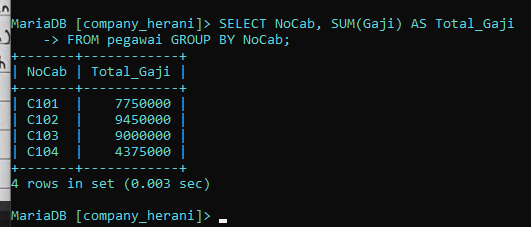 

 Analisis : 
 - `SELECT NoCab` :  digunakan untuk menentukan kolom yang akan ditampilkan dalam hasil query. Yang dimana data yang akan ditampilkan adalah NoCab yang menjadi dasar pengelompokan data.
 - `SUM(Gaji`) : digunakan untuk menjumlahkan nilai dalam kolom `Gaji` untuk setiap kelompok `NoCab`. 
 - `AS Total_gaji` : Hasil perhitungan diberi nama `total_gaji`, yang menjelaskan bahwa ini adalah jumlah total  gaji pegawai.
 - `FROM pegawai` : digunakana untuk menunjukkan dari tabel mana data tersebut diambil, data diambil dari tabel `pegawai`.
 - `GROUP BY NoCab` : digunakan untuk mengelompokkan data berdasarkan kolom `NoCab`
9. Menampilkan data gaji yang telah di kelompokkan berdasarkan gaji '>= 8000000' 
   code 
   ```sql
   SELECT NoCab, SUM(Gaji) AS Total_gaji
   FROM pegawai GROUP BY NoCab HAVING SUM(Gaji) >= 8000000;
   ```

   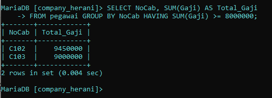

   Analisis : 
   - `SELECT NoCab` : digunakan untuk menentukan kolom yang akan ditampilkan dalam hasil query. Yang dimana data yang akan ditampilkan adalah NoCab yang menjadi dasar pengelompokan data.
   - `SUM(Gaji)` : digunakan untuk menjumlahkan nilai dalam kolom `Gaji` untuk setiap kelompok `NoCab`. 
   - `AS Total_gaji` :  Hasil perhitungan diberi nama `total_gaji`, yang menjelaskan bahwa ini adalah jumlah total  gaji pegawai.
   - `FROM pegawai` : digunakana untuk menunjukkan dari tabel mana data tersebut diambil, data diambil dari tabel `pegawai`.
   - `GROUP BY NoCab` : digunakan untuk mengelompokkan data berdasarkan kolom `NoCab`
   - `HAVING SUM(Gaji) >= 8000000` : digunakan untuk memfilter hasil yang telah dikelompokkan oleh `GROUP BY`. `SUM(Gaji)>= 8000000` menyaring kelompok-kelompok yang hanya memiliki total gaji (Total_gaji) sebesar 8.000.000 atau lebih. 
10. Menampilkan Rata-rata gaji pegawai
   code
   ```sql
   SELECT AVG(Gaji) AS Rata_rata FROM pegawai;
  ```

   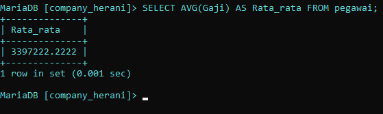

   Analisis : 
   - `SELECT` : digunakan untuk menentukan kolom mana yang ingin ditampilkan dalam hasil.
   - `AVG(Gaji)` : `AVG()` adalah fungsi agregat dalam SQL yang digunakan untuk menghitung rata-rata dari nilai-nilai dalam kolom yang ditentukan. `Gaji` adalah kolom yang berisi nilai gaji dari setiap pegawai.
   - `AS rata_rata` : Hasil perhitungan diberi nama `rata_rata`, yang menjelaskan bahwa ini adalah jumlah Rata-rata gaji pegawai.
   - `FROM pegawai` : digunakana untuk menunjukkan dari tabel mana data tersebut diambil, data diambil dari tabel `pegawai`.
11. Menampilkan Rata-rata gaji yang telah di jumlahkan pada jabatan 'Manajer' 
   code 
   ```sql
  SELECT AVG(Gaji) AS GajiRataMgr
  FROM pegawai 
  WHERE jabatan = 'Manajer';   
  ```

  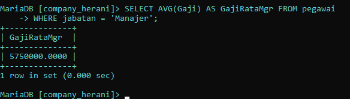

  Analisis: 
  - `SELECT` : digunakan untuk menentukan kolom mana yang ingin ditampilkan dalam hasil.
  - `AVG(Gaji)` : `AVG()` adalah fungsi agregat dalam SQL yang digunakan untuk menghitung rata-rata dari nilai-nilai dalam kolom yang ditentukan.  `Gaji` adalah kolom yang berisi nilai gaji dari setiap pegawai.
  - `AS GajiRataMgr` : Hasil perhitungan diberi nama `GajiRataMgr`, yang menjelaskan bahwa ini adalah jumlah Rata-rata gaji pada jabatan `Manajer`.
  - `FROM pegawai` : digunakana untuk menunjukkan dari tabel mana data tersebut diambil, data diambil dari tabel `pegawai`.
  - `WHERE jabatan = 'Manajer'` : digunakan untuk menyaring data yang akan diproses berdasarkan kondisi tertentu. Kondisi ini menyaring data sehingga hanya baris yang memiliki nilai jabatan sama dengan 'Manajer'.
 
12. Menampilkan rata-rata gaji yang sudah di kelompokkan berdasarkan 'NoCab'
   code 
   ```sql
  SELECT NoCab, AVG(Gaji) AS Rata_Gaji
  FROM pegawai GROUP BY NoCab;
  ```

  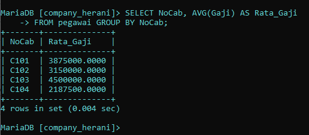

  Analisis : 
  - `SELECT NoCab` : digunakan untuk menentukan kolom yang akan ditampilkan dalam hasil query. Yang dimana data yang akan ditampilkan adalah NoCab yang menjadi dasar pengelompokan data.
  - `AVG(Gaji)` : `AVG()` adalah fungsi agregat dalam SQL yang digunakan untuk menghitung rata-rata dari nilai-nilai dalam kolom yang ditentukan.  `Gaji` adalah kolom yang berisi nilai gaji dari setiap pegawai.
  - `AS Rata_Gaji` : Hasil perhitungan diberi nama `Rata_Gaji`, yang menjelaskan bahwa ini adalah jumlah Rata-rata gaji pegawai.
  - `FROM pegawai` : digunakana untuk menunjukkan dari tabel mana data tersebut diambil, data diambil dari tabel `pegawai`.
  - `GROUP BY NoCab` : digunakan untuk mengelompokkan data berdasarkan kolom `NoCab`
13. Menampilkan rata-rata gaji yang sudah di kelompokkan berdasarkan 'NoCab' C101 dan C102
   Code
   ```sql
   SELECT NoCab, AVG(Gaji) AS Rata_Gaji
   FROM pegawai GROUP BY NoCab HAVING NoCab = 'C101' OR NoCab = 'C102';
  ```

  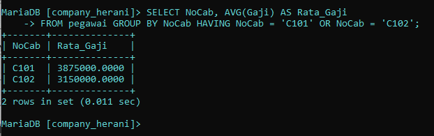

  ANALISIS : 
  - `SELECT NoCab` : digunakan untuk menentukan kolom yang akan ditampilkan dalam hasil query. Yang dimana data yang akan ditampilkan adalah NoCab yang menjadi dasar pengelompokan data.
  - `AVG(Gaji)` : `AVG()` adalah fungsi agregat dalam SQL yang digunakan untuk menghitung rata-rata dari nilai-nilai dalam kolom yang ditentukan.  `Gaji` adalah kolom yang berisi nilai gaji dari setiap pegawai.
  - `AS Rata_Gaji` : Hasil perhitungan diberi nama `Rata_Gaji`, yang menjelaskan bahwa ini adalah jumlah Rata-rata gaji pegawai.
  - `FROM pegawai` : digunakana untuk menunjukkan dari tabel mana data tersebut diambil, data diambil dari tabel `pegawai`.
  - `GROUP BY NoCab` : digunakan untuk mengelompokkan data berdasarkan kolom `NoCab`
  - `HAVING NoCab = 'C101' OR NoCab = 'C102'` : digunakan untuk menyaring data setelah pengelompokan Kondisi untuk menyaring hasil sehingga hanya cabang dengan nomor `C101` atau `C102` yang ditampilkan dalam hasil.
14. Menampilkan Gaji terbesar dan terkecil pada pegawai
   code 
   ```sql
  SELECT MAX(Gaji) AS Gaji_Terbesar, MIN(Gaji) AS Gaji_Terkecil
  FROM pegawai;
  ```

   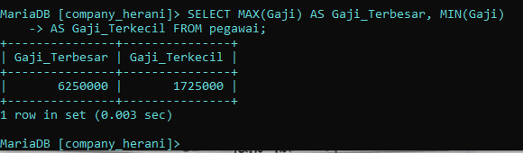

   Analisis: 
   - `SELECT` : digunakan untuk menentukan kolom mana yang ingin ditampilkan dalam hasil.
   - `MAX(Gaji)` : `MAX()` digunakan untuk menemukan nilai maksimum (nilai terbesar) dari kolom. `Gaji` adalah kolom yang berisi nilai gaji dari setiap pegawai.
   - `AS Gaji_Terbesar` : Hasil perhitungan diberi nama `Gaji_Terbesar`, yang menjelaskan bahwa ini adalah maksimum atau nilai terbesar gaji pada kolom pegawai.
   - `MIN(Gaji)` : `MIN()` digunakan untuk menentukan nilai minimum atau nilai terkecil dari kolom. `Gaji` adalah kolom yang berisi nilai gaji dari setiap pegawai.
   - `AS Gaji_Terkecil` : Hasil perhitungan diberi nama `Gaji_Terkecil`, yang menjelaskan bahwa ini adalah minimum atau nilai terkecil gaji pada kolom pegawai.
   - `FROM pegawai` : digunakana untuk menunjukkan dari tabel mana data tersebut diambil, data diambil dari tabel `pegawai`.
15. Menampilkan Gaji terbesar dan terkecil yang telah di kelompokkan berdasarkan jabatan 'Manajer'
   code 
   ```sql
  SELECT MAX(Gaji) AS Gaji_Terbesar, MIN(Gaji) AS Gaji_Terkecil
  FROM pegawai WHERE jabatan = 'Manajer' ;
  ```

  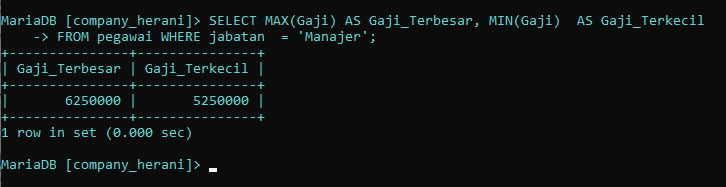 
  ANALISIS: 
 - `SELECT` : digunakan untuk menentukan kolom mana yang ingin ditampilkan dalam hasil.
 - `MAX(Gaji)` : `MAX()` digunakan untuk menemukan nilai maksimum (nilai terbesar) dari kolom. `Gaji` adalah kolom yang berisi nilai gaji dari setiap pegawai.
 - `AS Gaji_Terbesar` : Hasil perhitungan diberi nama `Gaji_Terbesar`, yang menjelaskan bahwa ini adalah maksimum atau nilai terbesar gaji pada kolom pegawai.
 - `MIN(Gaji)` : `MIN()` digunakan untuk menentukan nilai minimum atau nilai terkecil dari kolom. `Gaji` adalah kolom yang berisi nilai gaji dari setiap pegawai.
 - `AS Gaji_Terkecil` : Hasil perhitungan diberi nama `Gaji_Terkecil`, yang menjelaskan bahwa ini adalah minimum atau nilai terkecil gaji pada kolom pegawai.
 - `FROM pegawai` : digunakana untuk menunjukkan dari tabel mana data tersebut diambil, data diambil dari tabel `pegawai`.
 - `WHERE jabatan = 'Manajer' ` : digunakan untuk menyaring data yang akan diproses berdasarkan kondisi tertentu. Kondisi ini menyaring data sehingga hanya baris yang memiliki nilai jabatan sama dengan 'Manajer'.
16. Menampilkan Gaji terbesar dan terkecil yang telah di kelompokkan berdasarkan 'NoCab' 
  code 
  ```sql
  SELECT MAX(Gaji) AS Gaji_Terbesar, MIN(Gaji) AS Gaji_Terkecil
  FROM pegawai GROUP BY NoCab;
  ```

  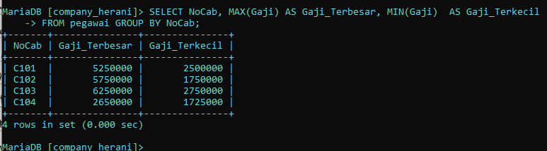 Analisis : 
  - `SELECT` : digunakan untuk menentukan kolom mana yang ingin ditampilkan dalam hasil.
  - `MAX(Gaji)` : `MAX()` digunakan untuk menemukan nilai maksimum (nilai terbesar) dari kolom. `Gaji` adalah kolom yang berisi nilai gaji dari setiap pegawai.
  - `AS Gaji_Terbesar` : Hasil perhitungan diberi nama `Gaji_Terbesar`, yang menjelaskan bahwa ini adalah maksimum atau nilai terbesar gaji pada kolom pegawai.
  - `MIN(Gaji)` : `MIN()` digunakan untuk menentukan nilai minimum atau nilai terkecil dari kolom. `Gaji` adalah kolom yang berisi nilai gaji dari setiap pegawai.
  - `AS Gaji_Terkecil` : Hasil perhitungan diberi nama `Gaji_Terkecil`, yang menjelaskan bahwa ini adalah minimum atau nilai terkecil gaji pada kolom pegawai.
  - `FROM pegawai` : digunakana untuk menunjukkan dari tabel mana data tersebut diambil, data diambil dari tabel `pegawai`.
  - `GROUP BY NoCab` : digunakan untuk mengelompokkan data berdasarkan kolom `NoCab`
17. Menampilkan Gaji terbesar dan terkecil yang hasil hitungannya lebih dari atau sama dengan 3
   code 
   ```sql
  SELECT MAX(Gaji) AS Gaji_Terbesar, MIN(Gaji) AS Gaji_Terkecil
  FROM pegawai GROUP BY NoCab HAVING COUNT(NIP) >= 3; 
  ```

  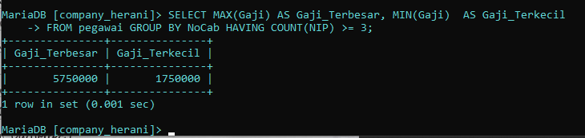

  Analisis : 
  - `SELECT` : digunakan untuk menentukan kolom mana yang ingin ditampilkan dalam hasil.
  - `MAX(Gaji)` : `MAX()` digunakan untuk menemukan nilai maksimum (nilai terbesar) dari kolom. `Gaji` adalah kolom yang berisi nilai gaji dari setiap pegawai.
  - `AS Gaji_Terbesar` : Hasil perhitungan diberi nama `Gaji_Terbesar`, yang menjelaskan bahwa ini adalah maksimum atau nilai terbesar gaji pada kolom pegawai.
  - `MIN(Gaji)` : `MIN()` digunakan untuk menentukan nilai minimum atau nilai terkecil dari kolom. `Gaji` adalah kolom yang berisi nilai gaji dari setiap pegawai.
  - `AS Gaji_Terkecil` : Hasil perhitungan diberi nama `Gaji_Terkecil`, yang menjelaskan bahwa ini adalah minimum atau nilai terkecil gaji pada kolom pegawai.
  - `FROM pegawai` : digunakana untuk menunjukkan dari tabel mana data tersebut diambil, data diambil dari tabel `pegawai`.
  - `GROUP BY NoCab` : digunakan untuk mengelompokkan data berdasarkan kolom `NoCab`
  - `HAVING COUNT(NIP) >= 3` : digunakan untuk menyaring kelompok hasil setelah proses `GROUP BY`. `COUNT(NIP)` yang digunakan untuk menghitung jumlah baris dalam setiap kelompok yang memiliki nilai `NIP` kondisi ` >= 3` berarti hanya yang memiliki tiga atau lebih pegawai yang akan ditampilkan dalam hasil.
18. Menampilkan MAX, MIN, SUM, AVG dan total pegawai pada tabel
   code 
   ```sql
   SELECT COUNT(NIP) AS jumlahpegawai, SUM(Gaji) AS TotalGaji,
   AVG(Gaji) AS RataGaji, MAX(Gaji) AS GajiMaks, MIN(Gaji) AS GajiMin
   FROM pegawai;
  ```

  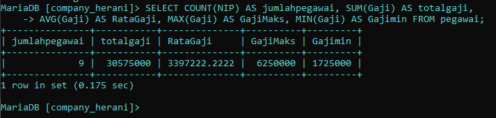

  ANALISIS : 
  - `SELECT` : digunakan untuk menentukan kolom mana yang ingin ditampilkan dalam hasil.
  - `COUNT(NIP)` : digunakan untuk menghitung jumlah kolom pada tabel `pegawai`  yang di mana `(NIP)` berfungsi menghitung  jumlah baris yang ada di dalamnya. 
  - `AS jumlahpegawai` : Hasil perhitungan diberi nama `jumlahpegawai`, yang menjelaskan bahwa ini adalah jumlah total pegawai.
  - `SUM(Gaji)` :  digunakan untuk menghitung jumlah total dari nilai-nilai yang ada dalam kolom `Gaji`.
  - `AS TotalGaji` : Hasil perhitungan diberi nama `TotalGaji`, yang menjelaskan bahwa ini adalah jumlah total  gaji pegawai.
  - `AVG(Gaji)` : `AVG()`  digunakan untuk menghitung rata-rata dari nilai-nilai dalam kolom yang ditentukan.  `Gaji` adalah kolom yang berisi nilai gaji dari setiap pegawai.
  - `AS RataGaji` : Hasil perhitungan diberi nama `RataGaji`, yang menjelaskan bahwa ini adalah jumlah Rata-rata gaji pegawai.
  - `MAX(Gaji)` : `MAX()` digunakan untuk menemukan nilai maksimum (nilai terbesar) dari kolom. `Gaji` adalah kolom yang berisi nilai gaji dari setiap pegawai.
  - `AS GajiMaks` : Hasil perhitungan diberi nama `GajiMaks`, yang menjelaskan bahwa ini adalah maksimum atau nilai terbesar gaji pada kolom pegawai.
  - `MIN(Gaji)` : `MIN()` digunakan untuk menentukan nilai minimum atau nilai terkecil dari kolom. `Gaji` adalah kolom yang berisi nilai gaji dari setiap pegawai.
  - `AS GajiMin` : Hasil perhitungan diberi nama `Gaji_Terkecil`, yang menjelaskan bahwa ini adalah minimum atau nilai terkecil gaji pada kolom pegawai.
  - `FROM pegawai` :  digunakana untuk menunjukkan dari tabel mana data tersebut diambil, data diambil dari tabel `pegawai`.
19. Menampilkan MAX, MIN, SUM, AVG dan total pegawai dari jabatan `Staf` dan `Sales` 
  code
  ```sql
   SELECT COUNT(NIP) AS jumlahpegawai, SUM(Gaji) AS TotalGaji,
   AVG(Gaji) AS RataGaji, MAX(Gaji) AS GajiMaks, MIN(Gaji) AS GajiMin
   FROM pegawai 
   WHERE jabatan = 'Staf'  OR jabatan = 'Sales'
   GROUP BY NoCab HAVING SUM(Gaji) <= 2600000;
 ```

 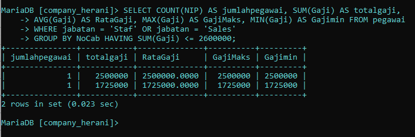

 analisis: 
  -  `SELECT` : digunakan untuk menentukan kolom mana yang ingin ditampilkan dalam hasil.
  - `COUNT(NIP)` : digunakan untuk menghitung jumlah kolom pada tabel `pegawai`  yang di mana `(NIP)` berfungsi menghitung  jumlah baris yang ada di dalamnya. 
  - `AS jumlahpegawai` : Hasil perhitungan diberi nama `jumlahpegawai`, yang menjelaskan bahwa ini adalah jumlah total pegawai.
  - `SUM(Gaji)` :  digunakan untuk menghitung jumlah total dari nilai-nilai yang ada dalam kolom `Gaji`.
  - `AS TotalGaji` : Hasil perhitungan diberi nama `TotalGaji`, yang menjelaskan bahwa ini adalah jumlah total  gaji pegawai.
  - `AVG(Gaji)` : `AVG()`  digunakan untuk menghitung rata-rata dari nilai-nilai dalam kolom yang ditentukan.  `Gaji` adalah kolom yang berisi nilai gaji dari setiap pegawai.
  - `AS RataGaji` : Hasil perhitungan diberi nama `RataGaji`, yang menjelaskan bahwa ini adalah jumlah Rata-rata gaji pegawai.
  - `MAX(Gaji)` : `MAX()` digunakan untuk menemukan nilai maksimum (nilai terbesar) dari kolom. `Gaji` adalah kolom yang berisi nilai gaji dari setiap pegawai.
  - `AS GajiMaks` : Hasil perhitungan diberi nama `GajiMaks`, yang menjelaskan bahwa ini adalah maksimum atau nilai terbesar gaji pada kolom pegawai.
  - `MIN(Gaji)` : `MIN()` digunakan untuk menentukan nilai minimum atau nilai terkecil dari kolom. `Gaji` adalah kolom yang berisi nilai gaji dari setiap pegawai.
  - `AS GajiMin` : Hasil perhitungan diberi nama `Gaji_Terkecil`, yang menjelaskan bahwa ini adalah minimum atau nilai terkecil gaji pada kolom pegawai.
  - `FROM pegawai` :  digunakana untuk menunjukkan dari tabel mana data tersebut diambil, data diambil dari tabel `pegawai`.
  - `WHERE jabatan = 'Staf'  OR jabatan = 'Sales'` :  `WHERE ` adalah kondisi yang harus di penuhi oleh suatu kolom. `jabatan = 'Staf'  OR jabatan = 'Sales'` adalah kondisi dari `WHERE` yang dimana hanya jabatan `staf` atau `sales` yang salah satunya terpenuhi agar bisa tampil.
  - `GROUP BY NoCab HAVING SUM(Gaji) <= 2600000` : `GROUP BY ` digunakan untuk mengelompokkan data sesuai dengan kolom yang dipilih. `NoCab` adalah nama kolom yang akan dikelompokkan datanya. `HAVING` adalah suatu kondisi yang harus dipenuhi agar data bisa di tampilkan . `SUM(Gaji) <= 2600000` kondisi dari `HAVING` hasil  data yang dijumlah gajinya kurang dari atau sama dengan `2600000` yang bisa tampil.

20. Menampilkan data yang tabelnya terpisah-pisah
 ``` sql
 SELECT orders.OrderID, orders.OrderDate, orders.custID, customers.CompanyName,
 customers.contactName, customers.City, customers.Phone FROM orders, customers
 WHERE orders.custID = customers.customerID ;
 ```
  hasil: 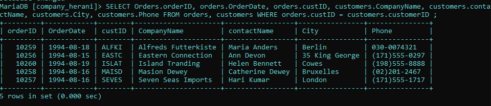 penjelasan: 
 - `SELECT` : digunakan untuk menentukan kolom mana yang ingin ditampilkan dalam hasil.
 - `Orders.orderID` : orders merupakan nama tabel yang ingin di tampilkan kolomnya yaitu orderID. Jadi kolom orderID dalam table order ingin di tampilkan 
 - `orders.OrderDate` : kolom orderDate dalam table orders ingin di tampilkan 
 - `orders.custID`: custID dalam tabel orders di pilih untuk di tampilkan 
 - `customers.CompanyName`: kolom CompanyName dalam tabel customer dipilih untuk di tampilkan. 
 - `customers.contactName`: kolom contactName dalam tabel customer di pilih untuk di tampilkan. 
 - `customers.City` : kolom City dalm tabel customer dipilih untuk di tampilkan.
 - `customers.Phone`: kolom phone dalam tabel customers di pilih untuk di tampilkan.
 - `FROM orders, customers` : untuk memilih dari tabel mana saja yang kolomnya ingin di pilih untuk di tampilkan. orders adalah nama tabel pertama yang dipilih dan customers adalah nama tabel kedua yang dipilih.
 - `WHERE` :  kondisi yang harus di penuhi oleh suatu data agar bisa ditampilkan.
 - `orders.custID = customers.customerID` : kondisi dari where yang harus di penuhi. Jadi, data pada kolom custID dalam tabel orders harus sama dengan data pada kolom customersID dalam tabel customer agar masing-masing datanya bisa di tampilkan 

21. Menampilkan data yang di mana hanya ada data yang beribukota London
 ```sql
 SELECT o.OrderID, o.OrderDate, o.CustID,
 c.CompanyName, c.contactName, c.City, c.Phone,
 FROM orders o, customers c
 WHERE o.CustID = c.CustomerID AND c.City = 'London';
 ```
 hasil: 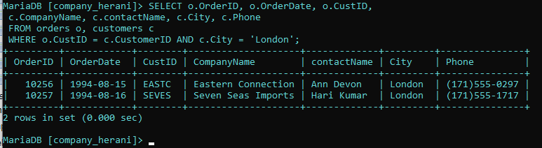
 penjelasan: 
  - `SELECT` : untuk memilih kolom mana saja yang ingin di tampilkan dari tabel mana kolom tersebut di ambil. 
  - `o.OrderID` : o merupakan singkatan dari tabel orders. Kolom orderID merupakan kolom dari table orders yang di pilih untuk di tampilkan.  
  - `o.OrderDate` : Kolom orderDate merupakan kolom dari tabel o yaitu orders yang dipilih untuk ditampilkan.
  - `o.CustID` : Kolom CustID merupakan kolom dari tabel o yaitu orders yang dipilih untuk ditampilkan.
  - `C.CompanyName` : c merupakan singkatan dari tabel customers. Kolom companyName merupakan kolom dari tabel customers yang dipilih untuk ditampilkan.
  - `C.contactName` : Kolom contactName merupakan kolom dari tabel c yaitu customer yang dipilih untuk ditampilkan.
  - `C.City` : Kolom City merupakan kolom dari tabel c yaitu customer yang dipilih untuk ditampilkan.
  - `C.Phone` : Kolom phone merupakan kolom dari tabel c yaitu customer yang dipilih untuk ditampilkan.
  - `FROM orders o, customers c` : untuk memilih dari tabel c yaitu customers yang dipilih untuk di tampilkan. orders adalah nama tabel yang dipilih untuk ditampilkan tapi disingkat jadi o, agar lebih mudah dan cepat. customer adalah nama tabel yang dipilih untuk di tampilkan tapi di singkat jadi c
  - ` WHERE` : kondisi yang harus di penuhi oleh suatu kolom data agar bisa ditampilkan 
  - `o.CustID = o.CustomerID AND o.City = 'London'` : data pada kolom CustID dalam tabel o(orders) harus sama dengan data pada kolom customerID pada tabel c(customer). `AND` untuk menyeleksi dua data atau lebih pada perintah WHERE. `o.City = 'London'` adalah kondisi tambahan yang dipenuhi juga pada kolom city dari tabel c (customers) datanya harus berisi data "London" agar bisa ditampilkan.
  
22. Menampilkan data yang dimana datanya sama dengan data table yang telah relasi
 ```sql
 SELECT o.OrderID, o.OrderDate, C.CompanyName, 
 c.contactName, c.Phone,e.LastName, e.Title 
 FROM Orders o, customers C, employees e
 WHERE o.CustID = c.CustomerID AND o.EmpID = e.EmpID;
 ```
   hasil: 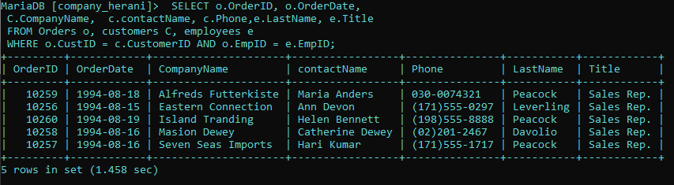
   penjelasan: 
   - `SELECT` : untuk memilih kolom mana saja yang ingin di tampilkan dari tabel mana kolom tersebut di ambil. 
   - `o.OrderID, o.OrderDate` : Kolom orderID dan orderDate dari tabel o(orders) di pilih untuk di tampilkan.
   - `C.CompanyName, c.contactName, c.Phone ` :  Kolom-kolom companyName, contactName dan Phone dari tabel c(customers) dipilih untuk ditampilkan.
   - `e.LastName, e.Title ` : kolom LastName dan Title dari tabel e( employees ) dipilih untuk ditampilkan. 
   - `FROM Orders o, customers C, employees e` : untuk memilih dari tabel mana saja yang kolomnya dipilih untuk ditampilkan . Orders disingkat jadi c adalah nama tabel yang dipilih, employees disingkat jadi e adalah nama tabel yang dipilih untuk di tampilkan. 
   - `WHERE` : kondisi yang di harus di penuhi oleh suatu data untuk di tampilkan. 
   - `o.CustID = c.CustomerID AND o.EmpID = e.EmpID` : data pada kolom CustID dalam tabel o (orders) harus sam dengan data pada kolom CustomerID pada tabel c (customers). `AND` untuk menyeleksi dua data atau lebih pada perintah WHERE. `o.EmpID = e.EmpID` data pada kolom EmpID dalam tabel o (orders) harus sama dengan data pada kolom EmpID dalam tabel e (employees).
23. Menampilkan data yang datanya terdapat nama Margaret
 ```sql
 SELECT o.OrderID, o.OrderDate, 
 c.CompanyName, c.contactName, c.Phone
 , e.LastName, e.Title
 FROM Orders o, customers c, employees e
 WHERE o.CustID = c.CustomerID AND o.EmpID = e.EmpID 
 AND e.FirstName = 'Margaret';
 ```
 hasil: 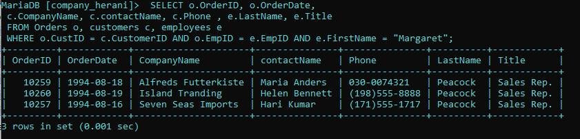
 penjelasan: 
 - `SELECT` : untuk memilih kolom mana saja yang ingin di tampilkan dari tabel mana kolom tersebut di ambil. 
 - `o.OrderID, o.OrderDate,` : Kolom orderID dan orderDate dari tabel o(orders) di pilih untuk di tampilkan
 - `c.CompanyName, c.contactName, c.Phone` : Kolom-kolom companyName, contactName dan Phone dari tabel c(customers) dipilih untuk ditampilkan.
 - `e.Title, e.LastName` : kolom LastName dan Title dari tabel e( employees ) dipilih untuk ditampilkan. 
 - `FROM Orders o, customers C, employees e` :  untuk memilih dari tabel mana saja yang kolomnya dipilih untuk ditampilkan . Orders disingkat jadi c adalah nama tabel yang dipilih, employees disingkat jadi e adalah nama tabel yang dipilih untuk di tampilkan. 
 - `WHERE o.CustID = c.CustomerID AND o.EmpID = e.EmpID e.FirsName = 'Margaret'` : `WHERE`  kondisi yang di harus di penuhi oleh suatu data untuk di tampilkan. `o.CustID = c.CustomerID`  data pada kolom CustID dalam tabel o (orders) harus sam dengan data pada kolom CustomerID pada tabel c (customers). `AND` untuk menyeleksi dua data atau lebih pada perintah WHERE.  `e.FirsName = 'Margaret'` data pada kolom First name dalam tabel e (employees) harus berisi data "margaret" agar bisa tampil.
24. Menampilkan data yang telah di urutkan
  ```sql
 SELECT c.CustomerID, c.CompanyName, o.OrderID,
 o.OrderDate, od.ProductID, od.Quantity, od.unitPrice
 p.ProductName, od.Quantity AS Qty
 FROM customers c, Orders o, orderdetails od, Products p
 WHERE c.CustomerID = o.custID AND o.OrderID = od.OrderID
 AND p.ProductID = od.ProductID ORDER BY c.CustomerID;
 ```
 hasil:  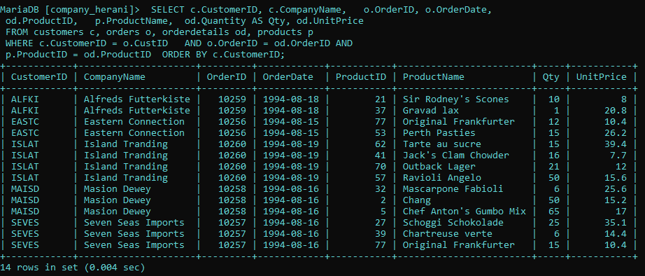
 penjelasan: 
  - `SELECT` : untuk memilih kolom mana saja yang ingin di tampilkan dari tabel mana kolom tersebut di ambil. 
  - `c.CustomerID,c.CompanyName` : kolom customerID dan companyName dari tabel c (customers) dipilih untuk di tampilkan.
  - `o.OrderID, o.OrderDate` : kolom orderID dan OrderDate dari tabel o(order) dipilih untuk ditampilkan.
  - `od.ProductID, od.Quantity, od.unitPrice` : kolom productID, Quality, dan unitPrice dari tabel od(orderDetail) yang dipilih untuk di tampilkan. 
  - `p.ProductName` : kolom ProductName merupakan kolom dari tabel p(product) yang dipilih untuk ditampilkan.
  - `od.Quantity AS Qty` : kolom quantity di tampilkan sebagai nama sementaranya yaitu qty. `AS` untuk mengubah nama suatu kolom secara sementara. 
  - `FROM customers C, Orders o, Orderdetails od, Products p` : untuk memilih dari tabel mana saja yang kolomnya dipilih  untuk di tampilkan. customers atau c adalah nama tabel yang pilih untuk di tampilkan. order atau o adalah nama tabel yang ingin  di tampilkan. orderdetails atau od adalah nama tabel yang ingin di tampilkan. product atau p adalah nama tabel yang dipilih untuk ditampilkan.
  - `WHERE c.customerID = o.custID AND o.OrderID = od.OrderID AND p.ProductID = od.ProductID ORDER BY c.CustomerID` : `WHERE` kondisi yang di mana harus di penuhi agar bisa di tampilkan. `c.customerID = o.custID` data pada kolom customerID dari tabel customers atau c harus sama dengan data pada kolom CustID pada tabel orders atau o. `AND` untuk menyeleksi dua data atau lebih pada perintah WHERE. `p.ProductID = od.ProductID` data pada kolom ProductID harus sama dengan data pada kolom ProductID pada tabel orderDetails atau od. `ORDER BY c.CustomerID` untuk megurut data berdasarkan kolom customersID dari tabel costomers.
25. Menampilkan gabungan dari beberapa data menjadi satu
  ```sql
  SELECT c.CustomerID, c.CompanyName, o.OrderID AS ordID, o.OrderDate, 
  CONCAT(e.LastName, ',' , e.firstname) AS EmployeName,
  od.productID AS ProdID, p.ProductName, od.Quantity AS qty
  FROM customers c, orders o, orderdetails od, product p, employees e
  WHERE c.CustomerID = o.CustID AND OrderID =  od.OrderID AND p.ProductID =    od.ProductID AND e.EmpID = od.EmpID ORDER BY o.OrderID; 
  ```
  hasil:  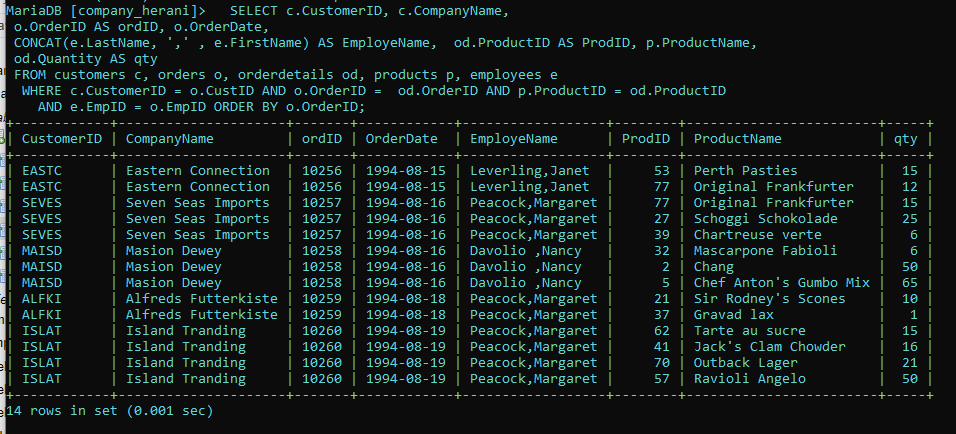
  penjelasan : 
   - `SELECT` : untuk memilih kolom mana saja yang ingin di tampilkan dari tabel mana kolom tersebut di ambil. 
   - `c.CustomerID, c.CompanyName` : kolom customerID dan companyName dari tabel c (customers) dipilih untuk di tampilkan.
   - `o.OrderID, o.OrderDate` : kolom orderID dan OrderDate dari tabel o(order) dipilih untuk ditampilkan.
   - `o.OrderID AS ordID, o.OrderDate` : kolom orderID dan Orderdate dari tabel o(orders) di pilih untuk ditampilkan. `AS` merupakan perintah untuk mengubah nama suatu kolom secara sementara
   - `CONCAT(e.LastName, ',' , e.firstname) AS EmployeName` : `CONCAT` adalah perintah untuk menggabungkan beberapa kolom data menjadi satu kolom data. `(e.LastName, ',' , e.firstname)` merupakan kolom-kolom yang ingin digabungkan. LastName dan FirstName adalah kolom dari tabel e(employees) yang ingin di gabung. `(',')` merupakan separator atau pemisah antara kedua kolom yang di gabung. AS employees untuk mengubah hasil CONCAT tadi menjadi employees(namanya) untuk sementara. 
   - `od.productID AS ProdID, od.Quantity AS Qty` : kolom productID  dan  quantity pada tabel od(orderdatails) dipilih untuk ditampilkan. kolom productID namanya diubah sementara menjadi prodID. kolom Quantity namanya di ubah sementara menjadi Qty.
   - `p.ProductName` : kolom productName dari tabel p(product) dipilih untuk ditampilkan. 
   - `FROM customers c, orders o, orderdetails od, products p, employees e` : untuk memilih dari tabel mana saja yang kolomnya dipilih  untuk di tampilkan. customers atau c adalah nama tabel yang pilih untuk di tampilkan. order atau o adalah nama tabel yang ingin  di tampilkan. orderdetails atau od adalah nama tabel yang ingin di tampilkan. product atau p adalah nama tabel yang dipilih untuk ditampilkan. employees atau e adalah nama tabel yang ingin ditampilkan.
   - `WHERE c.CustomerID = o.CustID AND o.OrderID = od.OrderID AND p.ProductID = od.ProductID AND e.EmpID = od.EmpID` : `WHERE` kondisi yang di mana harus di penuhi agar bisa di tampilkan. `c.customerID = o.custID` data pada kolom customerID dari tabel customers atau c harus sama dengan data pada kolom CustID pada tabel orders atau o. `AND` untuk menyeleksi dua data atau lebih pada perintah WHERE. `p.ProductID = od.ProductID` data pada kolom ProductID harus sama dengan data pada kolom ProductID pada tabel orderDetails atau od. `o.OrderID = od.OrderID` data pada kolom OrderID harus sama dengan data kolom OrderID pada orderdetails. `e.EmpID = od.EmpID` data pada kolom EmpID harus sama dengan  kolom EmpID pada tabel oderddetails.
   - ` ORDER BY o.OrderID` : `ORDER BY c.OrderID` untuk megurut data berdasarkan kolom OrderID dari tabel orders
   
26. Membuat tabel yang dimana datanya di ambil dari tabel yang sudah ada 
  ```sql
 CREATE VIEW cusroderEmp AS SELECT c.CustomerID, C.CompanyName,
 c.contactName, o.OrderID, o.OrderDate, e.EmpID, e.LastName, 
 e.FirstName FROM  customers C, Orders o, employees e
 WHERE c.CustomerID = o.CustID AND o.EmpID = e.EmpID ;

 SHOW tables 
 ```
 hasil: 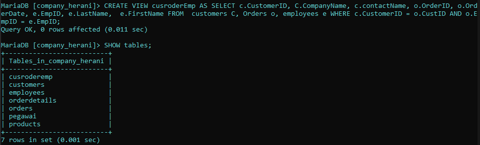
 
 ```sql
 SELECT * FROM cusroderEmp;
 ```
  hasil: 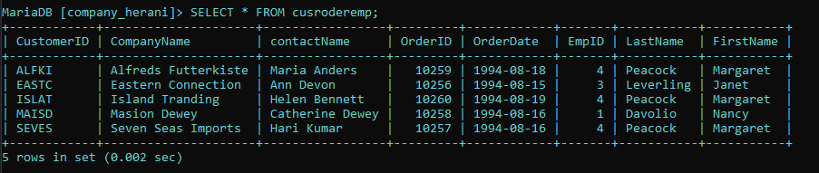
  penjelasan: 
  -  `CREATE VIEW cusroderEmp` : merupakan tabel virtual yang dibuat dengan nama  cusroderEmp.
  - `AS SELECT` : untuk memilih kolom-kolom mana saja yang dipilih untuk di masukkan ke tabel virtual.
  - `c.CustomerID, C.CompanyName,c.contactName`: kolom customerID, CompanyName, dan contactName dari tabel c(customer) dipilih untuk di masukkan datanya ke dalam tabel virtual.
  - `o.OrderID, o.OrderDate` : kolom OrderID, OrderDate dari tabel o(order) dipilih untuk dimasukkan datanya ke dalam tabel virtual.
  - `e.EmpID, e.LastName, e.FirstName` : kolom EmpID, LastName, FirstName dari tabel e(employees) dipilih untuk dimasukkan datanya ke dalam tabel virtual.
  - `FROM  customers C, Orders o, employees e` : untuk memilih tabel mana saja yang kolomnya dipilih untuk dimasukkan. customer, employees, dan order merupakan nama tabel yang kolomnya dipilih.
  - `WHERE c.CustomerID = o.CustID AND o.EmpID = e.EmpID` : `WHERE` kondisi yan harus dipenuhi oleh suatu kolom yang agar dapat bisa dimasukkan ke dalam tabel virtual. `c.CustomerID = o.CustID` data pada kolom customerID dari tabel c(customers) harus sam dengan data pada kolom custID dari tabel o(order) agar bisa di masukkan. s
  
27.  Membuat tabel baru yang dimana datanya di ambil dari kolom yang sudah ada
 ```sql
 CREATE VIEW odProducts AS SELECT od.OrderID, od.ProductID, od.unitPrice,
 od.Quantity, p.ProductName FROM orderDetails od, Products p
 WHERE p.ProductID = od.ProductID ;

 SHOW tables;
 ```
  hasil: 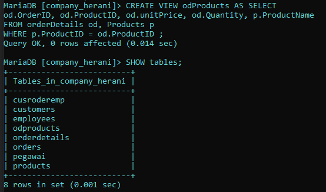
  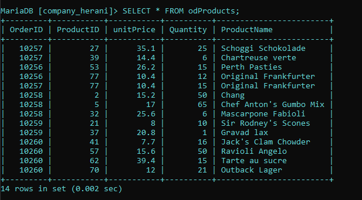
  penjelasan : 
  - `CREATE VIEW odProducts ` : merupakan tabel virtual yang dibuat dengan nama  odProducts.
  - `AS SELECT` : untuk memilih kolom-kolom mana saja yang dipilih untuk di masukkan ke tabel virtual.
  - `od.OrderID, od.ProductID, od.unitPrice,od.Quantity`: kolom OrderID, ProductID, unitprice dan Quantity dari tabel od(orderdetails) dipilih untuk dimasukkan datanya ke dalam tabel virtual.
  - `p.ProductName` : kolom ProductName dari tabel p(product) dipilih untuk dimasukkan datanya ke dalam tabel virtual.
  - `FROM orderDetails od, Products p` : untuk memilih tabel mana saja yang kolomnya dipilih untuk dimasukkan. products dan orderdetails merupakan nama tabel yang kolomnya dipilih.
  - `WHERE p.ProductID = od.ProductID` :  `WHERE` kondisi yan harus dipenuhi oleh suatu kolom yang agar dapat bisa dimasukkan ke dalam tabel virtual. `p.ProductID = od.ProductID` data pada kolom ProductID dari tabel p(product) harus sama dengan data pada kolom ProductID dari tabel od(orderdetails) agar bisa di masukkan.
  
28. Menampilkan data yang dimana datanya sudah di bulatkan
 ```sql
 SELECT c.customerid, c.companyname, o.orderid, 
 od.productid, ROUND(od.unitprice, 2), 
 od.quantity, od.discount, 
 ROUND(((1 - od.discount) * od.unitprice * od.quantity), 2) 
 AS Jumlah FROM customers c, orders o, 
 orderdetails od
 WHERE c.customerid = o.custid AND o.orderid = od.orderid
 ORDER BY c.customerid;
 ```
 hasil:  penjelasan: 
 - `SELECT ` : untuk memilih kolom mana saja yang ingin di tampilkan dari tabel mana kolom tersebut di ambil.
 - `c.customerid, c.companyname` : kolom customerID dan companyName dari tabel c (customers) dipilih untuk di tampilkan.
 - `o.orderid,` : kolom orderID dari tabel o(order) dipilih untuk ditampilkan.
 - `od.productid, od.quantity, od.discount` : kolom productID, Quantity, dan discount dari tabel od(orderdetails) dipilih untuk ditampilkan.
 - `ROUND(od.unitprice, 2)` : untuk membulatkan bilangan dari kolom unitprice sampai jumlah digit tertentu. sesuai dengan pilihan yang di buat yaitu 2
 - `ROUND(((1 - od.discount) * od.unitprice * od.quantity), 2) AS Jumlah` : untuk membulatkan bilangan dari kolom hasil dari (1 dikurangi kolom discount lalu dikali unitprice dan kali quantity) sampai jumlah digit yaitu 2.  `AS Jumlah` untuk mengubah kolom hasil tersebut nama sementara menjadi jumlah.
 - `FROM customers c, orders o, orderdetails od` : untuk memilih dari tabel mana saja yang kolomnya di plih untuk di tampilkan dan dibulatkan. 
 - `WHERE c.customerid = o.custid AND o.orderid = od.orderid` : `WHERE` kondisi yang di mana harus di penuhi agar bisa di tampilkan. `c.customerID = o.custID` data pada kolom customerID dari tabel customers atau c harus sama dengan data pada kolom CustID pada tabel orders atau o. `AND` untuk menyeleksi dua data atau lebih pada perintah WHERE. `o.orderid = od.orderid` data pada kolom OrderID harus sama dengan data kolom OrderID pada orderdetails.
 - `ORDER BY c.customerid` : untuk megurutkan data berdasarkan kolom customer dari tabel c(customer)
29. menampilkan data yang sudah di tambahkan
 ```sql
 SELECT c.customerid, c.companyname, 
 ROUND(SUM((1 - od.discount) * od.unitprice * od.quantity), 2) AS TotalJumlah
 FROM customers c, orders o, orderdetails od
 WHERE c.customerid = o.custid AND o.orderid = od.orderid
 GROUP BY c.customerid, c.companyname
 ORDER BY c.customerid;
 ```
  hasil: 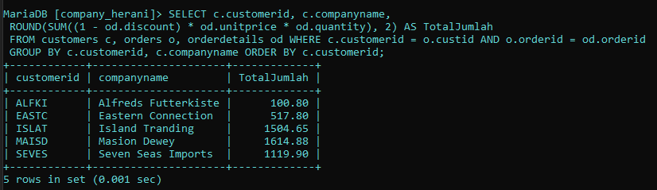 penjelasan: 
  - `SELECT`: untuk memilih kolom mana saja yang ingin di tampilkan dari tabel mana kolom tersebut di ambil.
  - `c.customerid, c.companyname` :  kolom customerID dan companyName dari tabel c (customers) dipilih untuk di tampilkan.
  - `ROUND(SUM((1 - od.discount) * od.unitprice * od.quantity), 2) AS TotalJumlah` : untuk membulatkan hasil SUM dari ((1 dikurang kolom discount ) dikali unitprice kali quantity) sampai 2 digit. Dan nama kolom hasilnya diubah sementara  menjadi totaljumlah.
  - `FROM customers c, orders o, orderdetails od` : untuk memilih dari tabel mana saja yang kolomnya di plih untuk di tampilkan dan dibulatkan.
  - `WHERE c.customerid = o.custid AND o.orderid = od.orderid` : `WHERE` kondisi yang di mana harus di penuhi agar bisa di tampilkan. `c.customerID = o.custID` data pada kolom customerID dari tabel customers atau c harus sama dengan data pada kolom CustID pada tabel orders atau o. `AND` untuk menyeleksi dua data atau lebih pada perintah WHERE. `o.orderid = od.orderid` data pada kolom OrderID harus sama dengan data kolom OrderID pada orderdetails.
  - `GROUP BY c.customerid, c.companyname` : 
  - `ORDER BY c.customerid` : untuk megurutkan data berdasarkan kolom customer dari tabel c(customer)